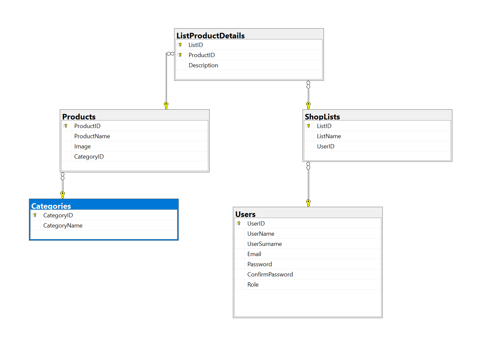
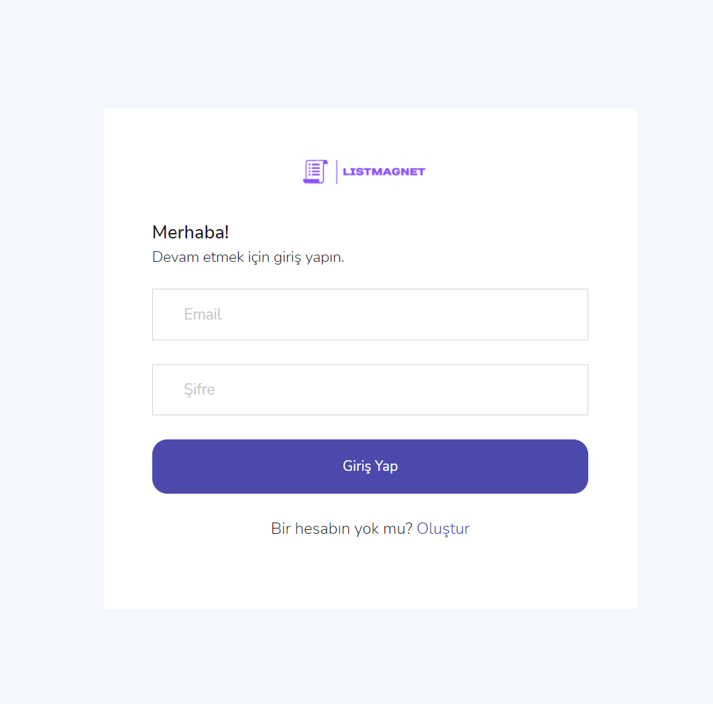
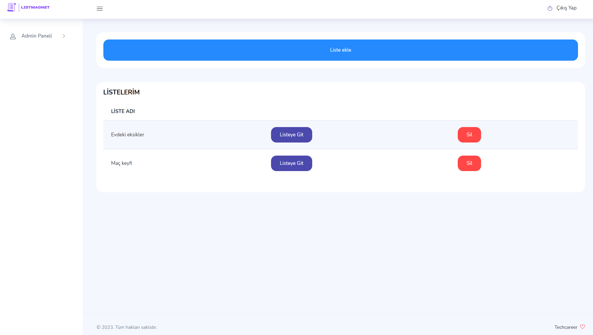
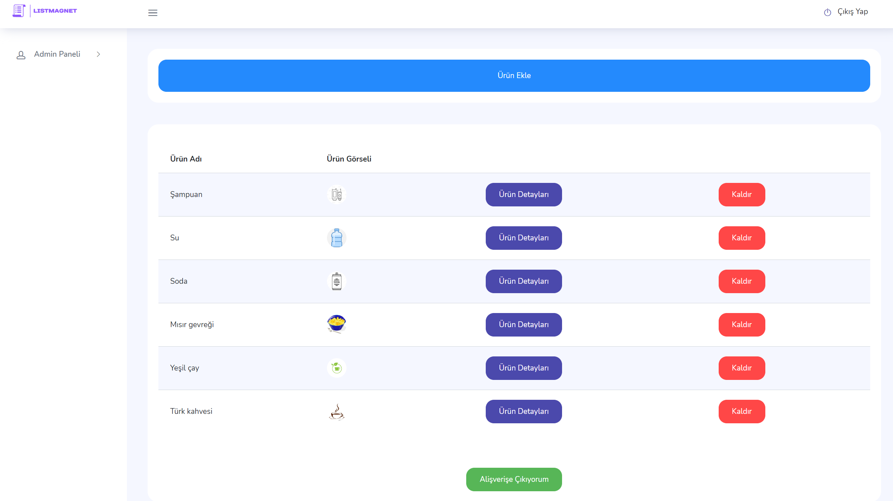
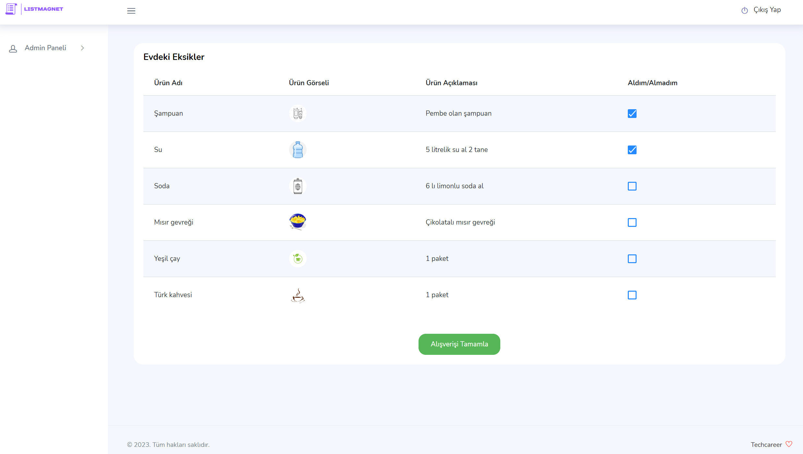
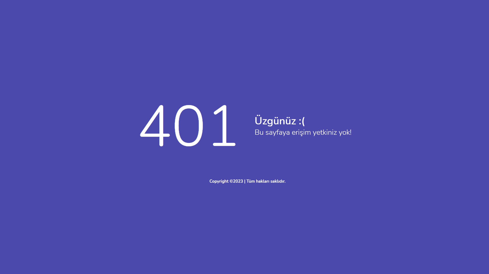
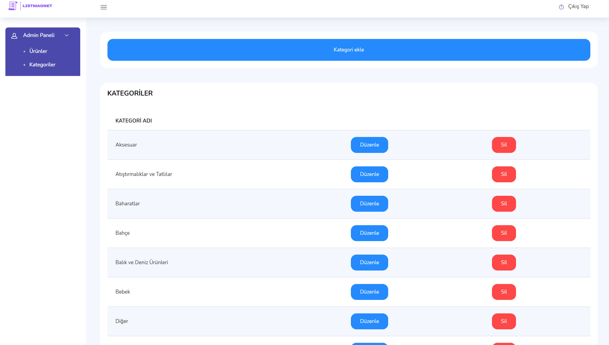

# ShopList📝
Bu proje Techcareer ile gerçekleştirilen Techcareer . Net Backend Bootcamp 'inin final case projesidir. 

📫Bizden istenilenlere genel olarak  bir bakalım.
<p>Projenin amacı, kullanıcıların alışveriş süreçlerini kolaylaştırmak adına almayı planladıkları ürünlerin listelerini oluşturabilmesi ve bu listelerin takiplerini yapabilmesidir.
Uygulamanın kullanılabilmesi için üye olmak gerekmektedir.</p>

 <p>➡️ Kullanıcılar sisteme kayıtlı oldukları bilgilerle giriş yaptıktan sonra işlevsellikleri kullanabileceklerdir.</p>
 <p>➡️ Kullanıcılar sisteme giriş yaptıktan sonra oluşturdukları alışveriş listelerini göreceklerdir. Buradan istedikleri listeyi seçip ürün ekleme ekrana geçebileceklerdir.</p>
 <p> ➡️ Ürün ekleyebilmeleri için listelenen ürünlerden istediklerine tıklayıp beklenen bilgileri girecek ve ekle diyeceklerdir. </p>
 <p> ➡️ Ürünlerin içerisinde ismiyle arama yapılabilecektir. İstenirse kategorisine göre de filtrelenecektir.</p>
 <p>  ➡️ Kullanıcılar listeleri sadece ürün ekleyerek değil, ürün kaldırarak da güncelleyebileceklerdir.</p>
 <p>  ➡️ Kullanıcı bir liste için “Alışverişe Çıkıyorum” seçeneğini işaretlediğinde artık o listeye ürün ekleyemeyecektir.</p>
 <p> ➡️ Kullanıcı ürünleri aldıkça liste üzerinden ilgili ürünü seçip “Aldım” diye işaretleyecektir. Liste için “Alışveriş Tamamlandı” seçeneğini işaretlediğinde liste müdaheleye açık hale gelecektir.</p>
 <p> ➡️ Sistemde yer alan ürünleri bilgileriyle beraber sistem yöneticisi ekleyecektir.</p>
 

 </br>
 
## PROJE DETAYLARI📝

✎Öncelikle projemiz bir .Net MVC projesidir .Projede veritabanı olarak MS SQL kullanılmıştır. Framework olarak Entity Framework kullnılmıştır. Ayrıca projemizde fluent validation , sayfalama işlemleri için X.Paged.List kütüphanesi kullnılmıştır. Projede code-first yaklaşımı uygulanmıştır.

🔒 Projemin katmanlarını oluşturuyoruz.Katmanlar aşağıda gösterilmektedr.

 
</br>

-----------------------------------------------------------------------
### 🌱ENTİTY LAYER (VERİ KATMANI)

✎ Entitylerimi bu katmanda oluşturuyorum. Burda örnek olarak User entitymi görebilirsiniz. Diğer entityleri projenin içerisinde inceleyebilirsiniz.

Oluşturulan entityler
- ⚡User,kullanıcı bilgilerini tutar.
- ⚡Product,Ürün bilgilerini tutar.
- ⚡ShopList, Kullanıcılara ait olan alışveriş listesini tutar.
- ⚡Category, kategori bilgilerini tutar.
- ⚡ListProductDetail, kullanıcılara ait olan alışveriş listelerinin içindeki ürünleri tutar. 
</br>

```c#
public class User
	{
    	public User()
		  {
				ShopLists = new HashSet<ShopList>();
		   }
	     	public int UserID { get; set; }
		    public string UserName { get; set; } = null!;
		    public string UserSurname { get; set; }= null!;
		    public string Email { get; set; } = null!; //uniq olmmalı
		    public string Password { get; set; }= null!;		
        public string ConfirmPassword { get; set; } = null!;
        public string Role { get; set; } = null!;
        public ICollection<ShopList> ShopLists { get; set; }
	}
```
</br>
🎈Entitylerimin arasındaki ilişkiler navigation propertyler ile kurulmuştur.Böylece ilişkisel bir yapı oluşturulmuştur.

✎ Ardından ShoppingDbContext sınıfımızı oluşturuyoruz.Sınfımız Entity Framework Core tarafından sağlanan DbContext sınıfından kalıtım alarak veritabanında modellerimize karşılık gelicek olan tabloların oluşmasını sağlar. Aradaki iletişimi oluşturarak veri tabanı ile işlemlerimizi de gerçkeleştirmemizi sağlar.
</br>

```c#
public class ShoppingDbContext : DbContext
	{
		protected override void OnConfiguring(DbContextOptionsBuilder optionsBuilder)
		{		
			optionsBuilder.UseSqlServer("Server=.;Database=ShoppingDB;Trusted_Connection=True;Encrypt=False");
		}

		// dbset
		public DbSet<User> Users { get; set; }
		public DbSet<Product> Products { get; set; }
		public DbSet<ShopList> ShopLists { get; set; }
		public DbSet<Category> Categories { get; set; }

		public DbSet<ListProductDetail> ListProductDetails{ get; set; }

	}
```

 </br>
<p>🖋 Ardından Entity Framework Code First yaklaşımı ile kullanacağımız veri tabanı modellerini(entity) ve ilişkilerini yapılandırabilmemizi sağlayan  Fluent api ile modellerimin konfigürasyonlarını  gerçekleştiriyorum. Bunun için entity katmanında Configurations klasörü oluşturuyorum.Ardından buraya her entity için gerekli konfigürasyonu sağlıyacağım classlarımı ekliyorum.Örnek olarak yukarıda verdiğim user sınıfın konfigürasyonunu veriyorum.</p>
</br>

```c#
public class UserConfiguartion : IEntityTypeConfiguration<User>
	{
		public void Configure(EntityTypeBuilder<User> builder)
		{
			builder.HasIndex(x => x.UserID);
			builder.Property(x => x.UserID).IsRequired().UseIdentityColumn();
			builder.Property(x => x.UserName).HasMaxLength(30).IsRequired();
			builder.Property(x => x.UserSurname).HasMaxLength(30).IsRequired();
			builder.Property(x=>x.Email).HasMaxLength(20).IsRequired();
			builder.HasIndex(x => x.Email).IsUnique();
			builder.Property(x => x.Password).HasMaxLength(8).IsRequired();
			builder.Property(x => x.ConfirmPassword).HasMaxLength(8).IsRequired();
      builder.Property(x => x.Role).HasMaxLength(10).IsRequired().HasDefaultValue("User");

       builder.HasCheckConstraint("CK_User_Password", "[Password] LIKE '%[0-9]%' AND [Password] LIKE '%[A-Z]%' AND [Password] LIKE '%[a-z]%'");

			builder.HasCheckConstraint("CK_User_ConfirmPassword", "[ConfirmPassword] LIKE '%[0-9]%' AND [ConfirmPassword] LIKE '%[A-Z]%' AND [ConfirmPassword] LIKE '%[a-z]%'");

            builder.HasData(new User()
            {
                UserID = 1,
                UserName = "Johannes",
                UserSurname = "Kepler",
                Email = "admin@hotmail.com",
                Password = "Johan123",
                ConfirmPassword = "Johan123",
                Role = "Admin"
            });

            builder.HasMany(a => a.ShopLists).WithOne(a => a.User).OnDelete(DeleteBehavior.Cascade);


		}
	}
```

</br>
🎯 Burda user oluşturulurken hasdata ile adminimin veritabanı oluşturulurken bilgilerinin oluşmasını sağlıyorum.

Ardından oluşturduğum configürasyonları dbcontext sınıfımda fluent api konfigürasyonlarımı mutlaka tanımlıyorum.
</br>

```c#
protected override void OnModelCreating(ModelBuilder modelBuilder)
{
			//modelBuilder.ApplyConfigurationsFromAssembly(Assembly.Load("03_Relationships"));
			modelBuilder.ApplyConfigurationsFromAssembly(Assembly.GetExecutingAssembly());
}
```

</br>
<p>İşlemler tamamlandıktan sonra migration işlemi yaparak modellerimi veritbanına yansıtıyorum.</p>
📊 Veritabanında tablolarımı oluşturuyorum.Aşağıda tablolarımın bir diyagramını görebiliirsiniz.
</br>

 

</br>

-----------------------------------------------------------------------
### 🌱PRESENTATION LAYER (SUNUM KATMANI)

Projede kullandığımız hazır tema olan skydash klasörünü wwroot içine yerleştiriyoruz.Ardından temamızı inceleyerek bizim için gerekli olan css dosyalarını projemize Client-Side Library ile indiriyoruz.bu şekilde yaparak düzgün bir şekilde css lerin projemize yansımasını sağlayarak temadaki görünümü de korumuş oluyoruz.

Ardından projede layout viewemı ayarlarak shared klasörüne ekliyorum.Ardından layoutumuda kendi içinde partial lara bölerek daha az satırlı bir layout oluşturuyoru.Bu şekilde daha yönetilebilir olmasını sağlıyorum.

⚓ Ardından bu katmanda işlemlerimiz gerçekleştiriceğimiz controller sınıflarımı oluşturuyorum.


Projede 9 adet controller sınıfı bulunmaktadır.Bunlar;

- ⚡ User controller, kullanıcının kendine ait olan işlemleri gerçekleştirdiği controllerdır.
- ⚡ Admin controller, admine ait olan işlemlerin gerçekleştirildiği controllerdır..
- ⚡Login controller, giriş işleminin gerçekleştirildiği controllerdır.
- ⚡Register controller,kayıt işlemlerinin gerçekleştirildiği controllerdır.
- ⚡ErrorPage controller , hata sayfalrı için oluşturulan controllerdır.


Controller sınıfımda gerekli actionlarımı ve onlara ait olan viewlarımı oluşturuyorum. Projede kullandığım viewmoedllerım içinde validatör lerimi yazıyorum.Böylece fluent validation kullanıımı gerçekleştiriyorum.


🪙 En son authontice ve authorization işlemini gerçekleştiriyorum. Ben projede bu işlemi cookie ile sağladım.
</br>

```c#
builder.Services.AddAuthentication(CookieAuthenticationDefaults.AuthenticationScheme).AddCookie(options =>
 {
     options.Cookie.Name = "NetCoreMvc.Auth";
     options.LoginPath = "/Login/Login/";
     options.AccessDeniedPath = "/ErrorPage/Error401/";

 });
```

</br>

🪪 Program.cs dosyamda  cookie oluşturma işlemini gerçekleştirdikten sonra login de giriş başarılı ise bir claim oluşturuyorum.Bu şekilde kişiler sadece kendi rollerinin yetkili oldukları controllerlara erişebilicekler.

</br>

🚪Controller sınıflarıma `[Authorize(Role="")]` attribute ile role bazlı giriş yetkilendirmesi veriyorum.Böylece bir kullanıcı admine ait controller sınıflarına erişim yetkisi olmuyuacak.

</br>

Projeme ait bir kaç ekran görüntüsünü aşağıda sizinle paylaşıyorum.
</br>
<p>🪐Kullanıcı girişi sayfam</p>
 
</br>
<p>🔎Hatalı giriş işlemi </p></p>
 
</br>
<p>💫Kullanıcının listelerinin görüntülendiği sayfa</p>
 
</br>
<p>📃Kullanıcının seçtiği listenin içini görüntülediği sayfa</p>
 
</br>
<p>🧷 Kullanıcı alışverişi tamamla dedikten sonra erişeceği sayfa </p>
 
</br>
<p>⚓Kullanıcı admin paneline erişmek isterse karşılaşacağı hata sayfası</p>
 
</br>
<p>🌕Admin tarafındaki ürünlerim sayfası</p>
 
</br>
<p>📌Paged yapısı</p>
 
</br>
<p>🗝️Admin tarafındaki kategori sayfası</p>
 
</br>
Diğer düzenleme vb.sayfalara projenin içerisinden bakabilirsniz 😊
</br>

📌`Önemli Bir Uyarı: Projeyi çalıştırırken mutlaka işlemleri tamamlayıp sayfalar arasında geri gelme işlemi yaptığımızda sayfayı yenileyelim. Eklediğimiz yenilikleri görmek adına `😉

----------------------------------------------------------------
Anlatıcaklarım bu kadar. Umarım açık olmuştur. 🧕🏻 Görüşürüz 🎉

## Badges

Add badges from somewhere like: [shields.io](https://shields.io/)

[](https://choosealicense.com/licenses/mit/)
[](https://opensource.org/licenses/)
[](http://www.gnu.org/licenses/agpl-3.0)

